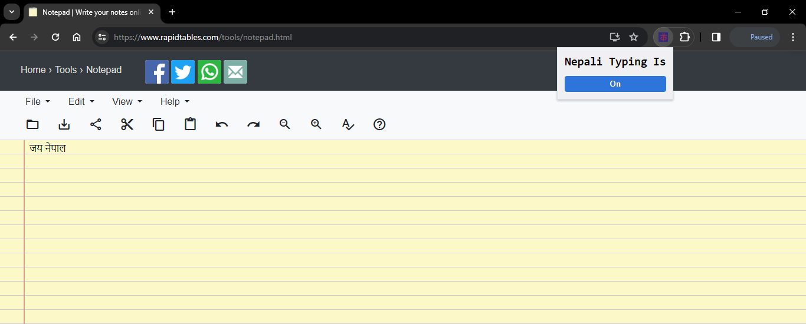

# Type Nepali Chrome Extension ⌨️✨

<p align="center">

 </p>
<p style="text-align: center;">
Type Nepali is a chrome extension that gives your browser the power to type in Nepali.
</p>

### Example



<b>Jay Nepal</b> becomes <b>जय नेपाल</b>

## How to use?

- Download or clone this repo on your machine

```bash
git clone https://github.com/AbhishekTimalsina/Type-Nepali.git
```

- Open Chrome and click the Extensions icon
- Select 'Manage Extensions'
- Enable developer mode from the top right corner
- Click "Load unpacked" and select the extension folder
- Thank me later.
